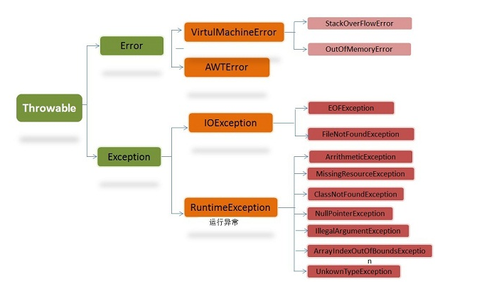

### 1.若有以下程序，则程序的输出结果是？

```c_cpp
#include<stdio.h>
main(){
    int c;
    c=10^5;
    printf("%d\n",c);
｝
```

- 5
- <u>**15**</u>
- 10000
- 105

解析：

运算符^是位运算符异或，也就是当二进制表示形式

相同为0，不同为1

10的二进制 0000 1010

5的二进制   0000 0101

结果二进制 0000 1111  也就是**15**

***

位运算符作用于位，并逐位执行操作。
&    
按位与操作，按二进制位进行"与"运算。运算规则：

0&0=0;   
0&1=0;    
1&0=0;     
1&1=1;    (A & B) 将得到 12，即为 0000 1100


|    
按位或运算符，按二进制位进行"或"运算。运算规则：

0|0=0;   
0|1=1;   
1|0=1;    
1|1=1;    (A | B) 将得到 61，即为 0011 1101


^    
异或运算符，按二进制位进行"异或"运算。运算规则：

0^0=0;   
0^1=1;   
1^0=1;  
1^1=0;    (A ^ B) 将得到 49，即为 0011 0001


~    
取反运算符，按二进制位进行"取反"运算。运算规则：

~1=-2;   
~0=-1;    (~A ) 将得到 -61，即为 1100 0011，一个有符号二进制数的补码形式。


<<    二进制左移运算符。将一个运算对象的各二进制位全部左移若干位（左边的二进制位丢弃，右边补0）。    A << 2 将得到 240，即为 1111 0000

右移相反 

## 2.指针就是地址,因此一个变量的指针就是该变量的地址。请问这句话的说法是正确的吗？

**<u>错误</u>**

解析：指针与指针变量是两个概念

指针是变量的地址，不同的操作系统，机器结构指针都会不同

32位 地址是32位的，64位地址是64位的

指针变量是存储指针的变量

变量的值是指针，变量的地址是存储指针的变量位置

类似于Java的引用

## 3.C 语言的当型循环是先执行循环后判断条件。请问这句话的说法是正确的吗？

**<u>错误</u>**

解析：循环分为当型（while）和直到型（do...while）

当型是先判断后循环

直到型先循环后判断

## 4.具有很多C语言的功能，又称过滤器的是？

- Csh
- tcsh
- **<u>awk</u>**
- sed

解析：

## 5.若有以下程序，则程序的输出结果是？

```c_cpp
#include < stdio.h >
main( )
{
    char a[5][10] ={ "one", "two", "three", "four", "five"};
    int i,j;
    char t; 
    for ( i=0;i<2;i++)
       for ( j=i+1;j<5;j++ )
            if ( a[i][0] >a [j][0] )
            {
                 t =a[i][0];
                 a[i][0] =a[j][0];
                 a[j][0] =t;
            }
  puts(a[1]);
}
```

- owo
- **<u>fwo</u>**
- two
- fix

解析：

二维数组初始化

char a[5][10] ={ "one", "two", "three", "four", "five"}其实就是

char a[5][10] ={ ｛one\0｝, ｛two\0｝, ｛three\0｝, ｛four\0｝, ｛five\0｝};

所以在双层循环中就是对首字母进行比较，最小的字母排最前。

## 6.能把函数处理结果的二个数据返回给主调函数，在下面的方法中不正确的是（）

- **<u>return这两个数</u>**
- 形参用数组
- 形参用两个指针
- 用两个全局变量

解析：

return返回的是返回值，在函数中可以有多个return语句，但是每次调用函数只能有一个返回值。return是提前结束函数的唯一办法，函数中遇到return语句立即返回，后面不在执行。

由于全局变量的作用域是从定义变量开始直到程序结束，而对于编写有多个返回值的C语言函数，我们可以考虑把要返回的多个值定义成全局变量。当函数被调用时，全局变量被更改，我们再把更改后的全局变量值应用于主调函数中。函数被调用后被更改后的全局变量值即为函数的数个返回值。

数组与指针在这个问题上是相似的都是进行函数参数的地址传递，地址传递由于传递过程中从实参传递过来的是地址，所以被调函数中形参值的更改会直接导致实参值的更改。

***

全局变量 局部变量 

- 局部变量 ：定义在函数体内部的变量，作用域仅限于函数体内部。离开函数体就会无效。再调用就是出错。

- 全局变量 ：所有的函数外部定义的变量，它的作用域是整个程序，也就是所有的源文件，包括.c和.h文件。

<br/>

## 7.有时为了避免某些未识别的异常抛给更高的上层应用，在某些接口实现中我们通常需要捕获编译运行期所有的异常， catch 下述哪个类的实例才能达到目的：（）

- Error
- **<u>Exception</u>**
- RuntimeException
- Throwable



## 8.假设函数原型和变量说明如下,下面哪一个调用是非法的？

```c_cpp
void f3(int(*p)[4]);
int a[4]={1，2，3，4}，
int b[3][4]={{1，2，3，4}，{5，6，7，8}，{9，10，11，12}};
```

- f3(&a);
- **<u>f3(b[1]);</u>**
- f3(&bb[1]);
- f3(b);

解析：

f3传递的参数是指针数组，而f3(b[1])传递的是值，

## 9.以下代码的执行结果是()***（有必要再看）

```c_cpp
int main(){
   int i=-2147483648;
   return printf("%d,%d,%d,%d",~i,-i,1-i,-1-i);
}
```

- 0,2147483648,2147483649,2147483647
- 0,-2147483648,-2147483647,2147483647
- 2147483647,2147483648,2147483649,2147483647
- **<u>2147483647,-2147483648,-2147483647,2147483647</u>**

解析：

首先，-2147483648这个数为32位int所能表示的最小负整数，而如果原码为 1000 0000  0000  0000  0000  0000  0000  0000（表示-0） ，其反码应为数值位取反，符号位不变，即1111  1111  1111  1111  1111  1111  1111  1111，
补码为反码+1 即为0 000 0000  0000  0000  0000  0000  0000  0000 （最高位溢出，舍去），
而+0 的原码、反码、补码均为 0 000 0000  0000  0000  0000  0000  0000  0000，
如果用 1000 0000  0000  0000  0000  0000  0000  0000作为 -2147483648的原码，则会导致 -2147483648和0的补码表示一样，因此，计算机中规定用 1000 0000  0000  0000  0000  0000  0000  0000来作为 -2147483648的补码，以确保-2147483648~2147483647都有唯一的补码表示；
总结以上内容：正数的原码、反码、补码形式一致，负数的反码为原码的数值位取反，补码为反码+1也即是原码的数值位取反再+1，计算机中以补码表示数据和运算，而32位最小负整数的补码为 1000 0000  0000  0000  0000  0000  0000  0000。
然后回到本道题目的解答：

首先，求 ~i ， i的补码为1000 0000  0000  0000  0000  0000  0000  0000，取反0111 1111 1111 1111 1111 1111 1111 1111，此为补码，符号位为0，表示正数，正数原码补码一致，因而该数即表示231-1，即2147483647 。

然后，求 -i ，要对一个数值执行单目运算符 -  表示的是对该数取反然后再+1，也即是我们常说的求补运算，注意这里取反+1与原码求补码的区别！也就是求补运算与求补码是不一样的！例子（4位有符号整数）：x=-4  1100（补码）   -x=~x+1 也即是 0011+0001=0100（4），而1100再求补码应是先数值位取反，即1011，然后+1，变成1100！注意这两者（求补与求补码）之间的区别。
题目中  i的补码为 1000 0000  0000  0000  0000  0000  0000  0000，取反+1,仍为 1000 0000  0000  0000  0000  0000  0000  0000，即    -2147483648

求 1-i  我们已经求出-i的补码为1000 0000  0000  0000  0000  0000  0000  0000 加上1的补码即为 1000 0000  0000  0000  0000  0000  0000  0001
该补码表示的原码为1 111 1111  1111 1111 1111 1111 1111 1111，即为- 2147483647

最后求-1-i  -1的补码为1 111 1111  1111 1111 1111 1111 1111 1111，加上-i补码 1000 0000  0000  0000  0000  0000  0000  0000，
得 0111 1111  1111 1111 1111 1111 1111 1111，即 2147483647

另外补充一点，计算机中有符号数和无符号数的机器码（补码）是一样的，同一个二进制码按照有无符号输出结果不一样，例如本题中四个答案如果按照无符号整数输出，那么答案就是C

## 10.下面代码在64位Linux系统编译执行，输出结果是____。

```c_cpp
#include <stdint.h> 
#include <stdio.h> 
void print_size(int32_t array[10]){ 
 printf("%d\n", sizeof(array)); 
} 
int main () { 
 int32_t myArray[10]; 
 printf("%d ", sizeof(myArray)); 
 print_size(myArray); 
} 
```

解析：

**<u>40 8</u>**

sizeof（）是一个运算符号，用来获取数据在内存中所占用的存储空间

不同数据类型在内存中分配大小不同，不同的编译器也会给相同的数据类型分配不同的内存空间。

int不管32还是64位在内存中占 4字节

10*4=40

而在函数中以数组为参数，传递的是数组的第一个元素的地址

地址的大小与操作系统有关，64位操作系统地址是64位的，也就是8个字节。