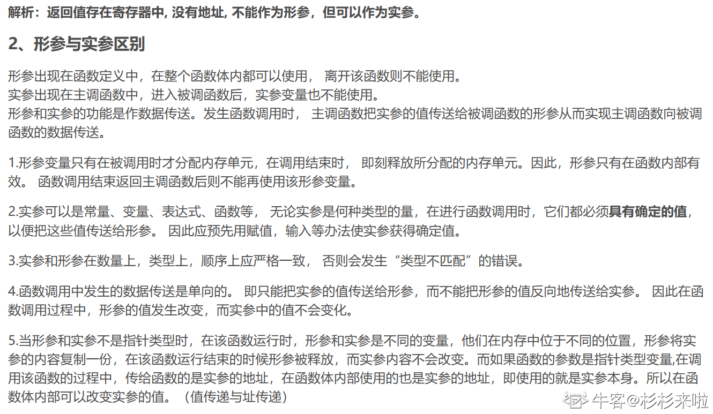

1.在某个类A中存在一个方法：void set(int x),以下不能作为这个方法的重载的声明的是

- [x] void set(int y)
- [ ] int set(int x，double y)
- [ ] double set(int x,int y)
- [ ] void set(int x,int y)

解析：

方法重载：方法名称相同，参数列表不同（可以是参数的类型，个数，顺序不同）

注意：如果两个方法只有返回值类型不同，编译器看还是同一个方法。

2.下面的函数原型声明中存在语法错误的是

- [ ] AA(int a, int b)
- [ ] AA(int, int)
- [x] AA(int a; int b;)
- [ ] AA(int a, int)

解析：

如果被调用函数（自定义函数）在主调函数的后面，则需要提前声明函数。

声明的作用是把函数名，参数类型和个数等通知给编译系统，以便编译系统正确识别并检查函数调用是否合法。

而函数就是通过函数原型进行声明，函数原型包含检查函数是否合法的基本信息

函数原型与函数的首行相同，其中形参名可以省略，只写类型。

3.在标准C中,while和do_while的功能完全相同。请问这句话的说法是正确的吗？

解析：错误

while先判断在执行，do.while先执行在判断，这样机制一般会导致后者多执行一次

4.下列变量说明语句中，正确的是

- [ ] char:a b c;
- [ ] char a;b;c;
- [ ] int x;z;
- [x] int x,z;、

5.函数调用不可以

- [ ] 出现在执行语句中
- [ ] 出现在表达式中
- [ ] 作为一个函数的实参
- [x] 作为一个函数的形参

解析：



6.对于条件表达式(k)?(i++):(i--)来说，其中的表达式k等价于

- [ ] k==0
- [ ] k==1
- [x] k!=0
- [ ] k!=1

解析：

条件表达式

逻辑表达式？表达式1：表达式2

逻辑表达式的值非零则条件表达式的值为表达式1，反之为表达式2

也就是==0为假，！=0为真

7.

```c_cpp
void main(void) {
    char *s = "1314520";
    int v1 = 0, v2 = 0, v3 = 0, v4 =0;
    for (int i = 0; s[i]; i++) {
        switch(s[i]) {
            default: v4++;
            case '1': v1++;
            case '2': v2++;
            cas3 '3': v3++;
        }
    }
    printf("%d, %d, %d, %d", v4,v1,v2,v3)
}
```

输出：

解析：

**<u>3,5,6,7</u>**

default顾名思义是缺省情况，只有任何条件都不匹配的情况下才会执行，故会匹配到s[i]为‘4’，‘5’，‘0’ 的情况。于是v4++三次，v4=3.并且这个default后没有使用break语句，于是case‘1’、‘2’、‘3’都会执行三次。注意到所以语句都没有加break，则语句执行过之后会继续下面的case语句，另外由于s[i]中有两个1，故v1,v2,v3此时为5.另外有一个2，v2,v3++后为6，还有一个case3 于是v3++.最终v3为7.

8.以下叙述中正确的是

- [ ] 即使不进行强制类型转换，在进行指针赋值运算时，指针变量的基类型也可以不同
- [x] 如果企图通过一个空指针来访问一个存储单元，将会得到一个出错信息
- [ ] 设变量p是一个指针变量，则语句p=0;是非法的，应该使用p=NULL;
- [ ] 指针变量之间不能用关系运算符进行比较

解析：

指针变量只能赋予地址，不能赋予其他且必须与指向对象的基类型相同。

指针变量之间进行关系运算可比较他们所指元素的关系。

空指针不指向任何类型的数据。

9.假设已经有定义“ const char*name=" chen " ;”，下面的语句中错误的是

- [x] name[3]='q';
- [ ] name="lin";
- [ ] name=new char[3];
- [ ] name=new char('q');

解析：

指针变量引用字符串实际是把第一个字符的地址赋给了指针变量，而字符串是存储在一个无名的字符数组中。

10.下列关于bool,int,float,指针类型的变量a 与“零”的比较语句正确的有？

- [x] bool : if(!a)
- [x] int : if(a == 0)
- [ ] float: if(a == 0.0)
- [x] 指针: if(a == nullptr)

解析：

由于计算机二进制表示浮点数有精度的问题，0.0(浮点double)实际上不是0，而是非常接近零的小数，所以C错！
在ANSIC C中定义了FLT_EPSILON/DBL_EPSILON/LDBL_EPSILON来用于浮点数与零的比较，一般if(fabs(a)<FLT_EPSILON)或if(fabs(a)< DBL_EPSILON)就可以表示a是否“为0”。而if(a==0.0)是永远不会成立的，达不到要求！
