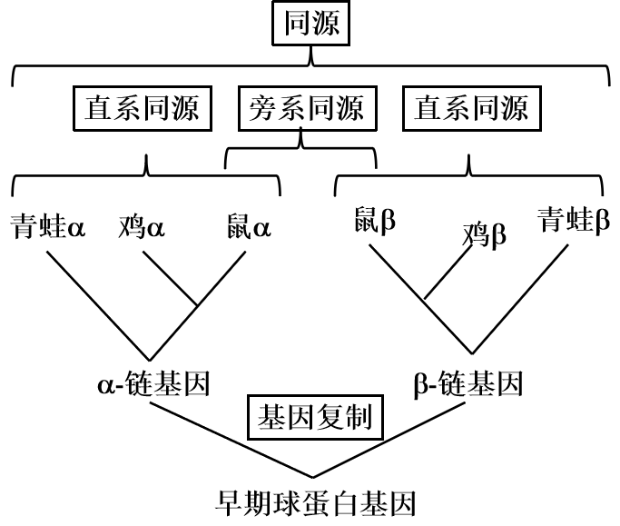

比较是科学研究中最常见的研究方法之一，通过比较寻找研究对象可能具备的某些特征和特性。序列比较的理论基础是进化学说：如果两个序列之间具有足够高的相似性，那么两者可能是共同的进化祖先经过序列内残基的替换，残基或序列片段的缺失或插入以及序列重组等遗传变异过程分别演化而来。

***

序列比较的目的主要有两点：

- 根据相似性通过已知序列来预测未知序列的结构和功能
- 推断序列之间的同源性，推测进化关系

## 相似性 同源性

任意两条序列都有可能具有一定的相似性，可以利用一个数值进行表示相似程度，所以相似性也就是序列比对结果中相同部分所占比例的大小。

相似性很难把“偶然性”的相似与真实进化和功能关系上的相似区分开来，所以相似性无法判断同源性。

所以同源性指的是来源于相同祖先的相似序列，且与相似性不同，其无法用数值表示，是一种论断，两条序列之间要么是同源的，要么是不同源的，即使相似性很低也有可能是同源的。

### 直系同源，旁系同源，异同源

同源又可分为直系同源（orthology）和旁系同源（paralogy）两类。直系同源序列是不同物种内的同源序列，它们来自于物种形成时的共同祖先基因。旁系同源基因是通过类似基因复制的机制产生的同源序列。

### 序列比较：核苷酸序列还是蛋白质序列

相对于核苷酸序列比较，氨基酸序列比较通常具有更丰富的信息，例如，许多氨基酸具有相似的理化性质（如赖氨酸和精氨酸都是碱性氨基酸），在进行氨基酸序列比较时可以用一打分系统来描述这些相关（但不匹配）的氨基酸之间的重要相关性。此外，蛋白质相对于核酸序列更为保守，只要这些物种有一个10亿年前（billion years ago, BYA）的共同祖先（例如谷胱甘肽转移酶），氨基酸序列比对可用于确定来自各物种的同源序列，而核苷酸序列比对一般情况下只能回溯到最多6亿年前（600million years ago, 600MYA）。
在某些特殊的情况下，比较核苷酸序列会更合适。比如，当确认给定DNA序列和DNA数据库中序列的一致性时，搜索多态性时，以及分析所克隆的cDNA片段的一致性等情况时，核苷酸序列的比较就显得重要。

***

具有同源性的序列都来自同一祖先经过序列内残基的替换，残基或序列片段的缺失或插入以及序列重组等遗传变异过程分别演化而来

## 序列比对

在进化过程中序列发生了差异，而序列比对就是通过特定的算法找出序列之间产生最大相似度得分的空格插入和序列排序方案。

### 空位

空位就是同源序列在进化过程产生分歧的突变（插入或删除等），在序列中补齐空位更加符合进化过程且更方便全长比对。

### 全局比对 局部比对

全局比对是序列全长进行比对，从全局出发进行考察序列之间的关系。

局部比对是着重于序列中的特殊片段，主要由于功能是由较短序列片段组成且较为保守，即使其他位点有空位存在也不会影响比对发现不同序列中的保守序列。
