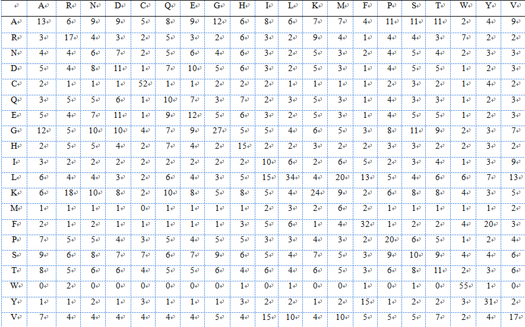
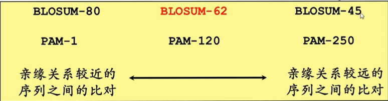

在序列比对时，因为空格插入不同产生了多种序列排序方案，可以通过替换计分矩阵这一计分规则来筛选出比对最大相似度的方案。

***

核酸和蛋白质分别有不同的替换计分矩阵。

## 核酸

### 等价矩阵

相同核苷酸之间的匹配得分为1，不同核苷酸间的替换为0。

### 转换-颠换矩阵 

核酸的碱基按照结构可分为两类：

- 嘌呤（两个环）

- 嘧啶（一个环）

不同结构之间替换称为颠换，相同结构替换为转换

在进化中转换频率远大于颠换，所以转换得分为-1，颠换为-5。

### BLAST矩阵

经过大量实际比较得，核苷酸相同的+5，反之为-4，则效果较好，该矩阵被广泛采用。

## 蛋白质

### 等价矩阵

相同氨基酸之间的匹配得分为1，不同氨基酸间的替换为0。

### 遗传密码矩阵GCM

通过计算一个氨基酸残基转变到另一个氨基酸残基所需的密码子中碱基变化数目而得到的，矩阵元素的值对应于代价。

### 疏水矩阵

不同的氨基酸具有不同的疏水性，而疏水性对蛋白质的结构和功能有很大影响，所以根据氨基酸替换前后的疏水性变化，进行打分。

### PAM矩阵

> Dayhoff模型：可接受点突变
> 
> 有些氨基酸替换较为频繁，自然界易接受这种突变，也就是可接受点突变，得分应该较高

PAM矩阵是目前蛋白质序列比较中最广泛使用的计分方法之一。

PAM矩阵中的元素表示是在一给定进化时期内氨基酸替换为某一氨基酸的变化概率，给定的进化时间就是一个PAM（不同蛋白质的替换速率不同，所以不用时间，以两个蛋白质1%氨基酸发生变化为时间进度），一个PAM内的变化概率也就是PAM-1。

PAM矩阵是通过紧密相关蛋白质序列的比对（>=85%），而研究进化程度较远的蛋白质一般用PAM-N，PAM-N是通过PAM-1自乘n次得到的，最常用PAM-250。

<u>**PAM250突变概率矩阵**</u>

### BLOSUM矩阵

BLOSUM矩阵通过关系较远的序列来获得矩阵元素，这种方法的优点是符合实际的观测结果，不足之处是不能和进化挂起钩来。

BLOSUM的工作集中于远相关蛋白的保守区域上，而BLOSUM-62表示蛋白质的一致度>=62%。

### PAM还是BLOSUM？

- PAM-1矩阵是基于相似度较高的序列而来，只描述了在较短进化时期内每个氨基酸发生变化的频度，对于较远进化距离的矩阵并非通过真实数据产生，而是通过PAM-1自乘得到，所以PAM-N不适合用于关系较远的序列比较。
- BLOSUM矩阵基于蛋白质序列块比对，利用相关序列中最相似的共同区域中氨基酸的替换和匹配。

对于关系较远的序列之间的比较，由于PAM-250是推算而来的，所以其精度受到一定的影响，BLOSUM-45更具优势。

对于关系较近的序列之间的比较，由于PAM或BLOSUM矩阵做出的比对结果，差距不大，最常用：BLOSUM-62。
