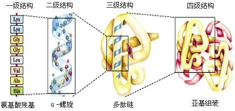

蛋白质的空间结构是其行使功能的基础，所以蛋白质既有序列数据库还有结构数据库。

***

# 蛋白质序列数据库

蛋白质序列数据库有很多，如SwissProt，TrEMBL，Pir等。

Pir是世界上第一个具有分类和功能注释的蛋白质序列数据库。

SwissProt包括了从EMBL翻译而来的蛋白质序列，经过人工校验和注释，冗余度较小。

为了解决人工注释较慢的问题，建立了由计算机注释的TrEMBL数据库，该数据库序列由EMBL中核酸序列翻译而来，其中剔除了包含在SwissProt数据库中的蛋白质序列。

## UniProt数据库

 整合了SwissProt，TrEMBL，Pir三家数据库的资源构建了通用蛋白质数据库。

UniProt分为三层：

- UniParc

由于蛋白质序列冗余，将序列相同的合并为一条，为每条序列提供唯一的编号。

- UniRef

为了加快检索速度，将UniParc中的序列根据一定的条件进行分类并去除冗余。

- UniProtKB

分为UniRef/TrEMBL和UniRef/SwissProt两部分，为其提供序列的详细信息。

***

# 蛋白质结构数据库

> 蛋白质空间结构
> 
> 一级：组成蛋白质的氨基酸序列。
> 
> 二级：由氨基酸序列在空间构成的有规律的结构，一般依靠氢键，疏水键等非共价键维持空间结构，如α螺旋，β折叠。
> 
> 结构域：介于二级和三级结构之间，蛋白质上的功能区域。
> 
> 三级：在二级基础上经过进一步弯曲折叠形成的结构。
> 
> 四级：单体蛋白通过非共价键结合形成的聚合体。

## PDB数据库

PDB通过存储原子坐标数据记录蛋白质分子空间结构，数据主要来源是X射线衍射，核磁共振等试验方法所得。

PDB以文本形式存储数据，为了方便查应与结构模型显示软件（RasMol，MBT，JSmol）结合起来以图形方式显示三维结构。

## 蛋白质结构家族分类数据库

蛋白质结构相比序列在进化上相对更加保守，相同的结构家族同源关系更加可靠，且同一家族功能往往相似，可以进行功能推断。

蛋白质结构家族分类数据库主要由：SCOP,CATH,FSSP。

- SCOP（人工分类）

- CATH（半自动分类）

***

# 蛋白质组

> 基因组 转录组 蛋白质组
> 
> 基因组：构成完整生物体的全部DNA。
> 
> 转录组：一个基因组表达的全部RNA。
> 
> 蛋白质组：一个基因组表达的全部蛋白质。
> 
> 蛋白质组随着时间而变化，并且蛋白质组因为选择性剪切和翻译后修饰等存在，蛋白质组总是多于基因组的基因数目。