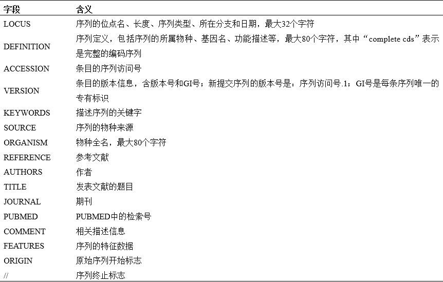

核酸序列数据库主要包括了基因组DNA序列，mRNA序列，tRNA序列，rRNA序列等核酸序列。国家上有三个主要核苷酸序列公共数据库：

- 位于英国剑桥的欧洲分子生物学实验室的欧洲核苷酸档案库（[ENA](https://www.embl.de/research/index.php)）
- 位于美国的生物技术信息中心的[GeneBank](https://www.ncbi.nlm.nih.gov/genbank/)数据库
- 位于日本的DNA数据库（[DDBJ](https://www.ddbj.nig.ac.jp/index-e.html)）

分别收集来自不同地区的数据，三大数据库进行数据共享且向世界开放。

核酸序列数据增长迅速，所以数据库版本更新较快，进行生物信息学分析时，务必注明数据库的数据状况及时间。

***

为维持数据的原始性，未经原作者允许，不能对原始数据库中的数据记录进行更新，修改，甚至加上注释，这就是一级数据库。

# 一级数据库

以Genbank为例：

## [Genbank](https://www.ncbi.nlm.nih.gov/genbank/)

### 数据组织形式

数据库中数据量巨大且不断增长，为了方便数据的维护管理以及查询，将数据进行分类，分为不同的子数据库（不同的数据库分类依据略有不同）：

- 种属来源

如哺乳类、啮齿类和病毒等

- 特点测序策略

主要依据序列来源分为专利、人工合成、表达序列标签（Expressed Sequence Tags，EST）、高通量基因组测序（High Throughput Genomic sequencing，HTG）、序列标签位点（Sequence Tag Site，STS）以及基因组概览序列（Genome Survey Sequence，GSS）分支等

### 数据格式

GenBank数据库不仅给出了序列信息，还包含了全面的注释信息。

序列文件由单个序列条目组成，序列条目由字段组成，有些字段又分若干子字段，每个字段由关键字起始。

### GenBank数据的访问

对GenBank数据库中海量数据进行访问的途径主要有四种：一是通过NCBI的Entrez检索系统（http://www.ncbi.nlm.nih.gov/Entrez/）进行检索访问；二是提交序列与GenBank或者其中某个子库进行序列比对，通常使用NCBI提供的序列比对工具BLAST（http://www. ncbi.nlm.nih.gov/BLAST/）；三是当需要大量访问GenBank中的数据时，可以利用NCBI提供的FTP（ftp://ftp.ncbi.nih.gov）下载功能将全部数据下载到本地使用。不过即使是这种情况下，一般也只需要下载GenBank的某个分支子库，如PRI子库等；四是采用NCBI电子编程工具（NCBI e-utilities（http://www.ncbi.nlm.nih.gov/entrez/query/static/eutils_help.html），即“Entrez Programming Utilities”，编程实现序列的查询、链接和下载。

***

随着数据的积累，一级数据库中存在很多数据冗余和不完全数据，所以在一级数据库基础上对数据进行整合，加工，以及添加注释随之产生二级数据库。

# 二级数据库

## [RefSeq](ftp://ftp.ncbi.nih.gov/refseq/)数据库

参考序列数据库RefSeq（The Reference Sequence）是NCBI建立的一个收集了基因组DNA、转录物RNA和蛋白质产物等的，全面的、整合的、非冗余的序列集合。RefSeq是医学（medical）、功能学（functional）和差异性（diversity）等研究的基石，为基因组注释（genome annotation）、基因辨识和特征分析（gene identification and characterization）、突变和多态性分析（mutation and polymorphism analysis）、表达研究（expression studies），以及比较分析（comparative analyses）等提供了参考。RefSeq的独特之处在于提供了巨大的、多物种的、人工注释和审核的序列数据库，明确地关联了染色体、转录本和蛋白质信息，将来源于序列、遗传、表达和功能信息等多个数据源的大量相异数据整合为一个单一、一致和具有标准协议的数据集合。

### RefSeq的特点

- 非冗余，RefSeq数据库是一个非冗余的DNA、RNA和蛋白质的数据集合，这一点明显不同于GenBank；
- 明确地将核酸序列和蛋白质序列关联起来，并以转录物为单位组织相关mRNA和蛋白质的序列和注释等重要信息；
- 维持更新以反映最新的序列数据和生物学知识；
- 数据经过校验，特别是标记为“REVIEWED”或“VALIDATED”的RefSeq mRNA序列已经过了人工审查，序列质量相对可靠。

## dbEST数据库

表达序列标签数据库，包含来源于不同物种的表达序列标签（EST）

## Gene数据库

为用户提供基因检索注释和检索服务，收录来自5300多个物种的430万条基因记录

## 非编码RNA数据库

非编码RNA包括rRNA，tRNA，snRNA，snoRNA，microRNA等，共同特点是能够转录却不能翻译成蛋白质，在RNA水平行使各自功能。根据长度又可分：

- 非编码小RNA
- 长非编码RNA

数据库有：

- miRBase数据库  microRNA序列及相关注释
- LncRNAdb数据库 真核生物已注释功能的长非编码RNA
- Rfam数据库 包含非编码RNA家族以及其他一些RNA元素家族

***

# 基因组数据库

> 基因组 基因
> 
> 基因组组成完整生物体的全部DNA集合，基因是基因组中在染色体上的具有遗传效应的片段。
> 
> 随着错误的基因测序结果被纠正，基因组也会随之改变，所以研究基因组要明确基因组组装版本。

## ensemble数据库

基因组数据库不同于基因序列数据库，不仅包含核酸序列数据还包含基因表达，突变位点，基因组定位，相关文献等内容。
