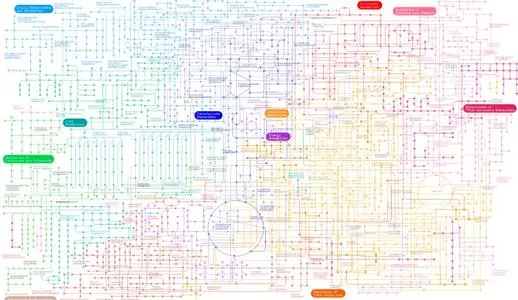

生物数据库除核酸和蛋白质还有一些专用数据库。

***

当你明确研究对象，应尽可能多的寻找并阅读相关文献。

# 文献数据库

## [PubMed](http://pubmed.nubi.nlm.nih.gov)数据库

Pubmed是互联网最著名的免费Medline数据库，由NLM的生物信息技术中心（NCBI）提供。

pubmed数据源：

- MEDLINE indexed：主体、标有主题词（MeSH，medical subject headings，医学主题词）、文献类型等字段。
- OldMEDLINE：1950-1965年间的美国医学索引（IM）中的题录（无文摘），约200万篇，逐渐并入MEDLINE主库。
- In-process citation：临时库，收录准备进行标引的题录和文摘信息，动态更新，标引主题词等字段后进入Medline。
- Publisher-Supplied Citations：出版商提供的所有文献，包括非Medline收录范围文献。

# 疾病相关数据库

随着生物医学研究的深入，科学家们已经认识到人类的疾病或多或少、直接或者间接的与基因存在某种关系，即使是外伤、中毒或者感染，都与个人的免疫能力有关，而免疫能力也是与基因相关的。可以认为人类疾病都是广义的“基因病”。

基因病可以分为单基因病，多基因病，染色体病以及获得性基因病。

> 单基因病：遗传受一对等位基因控制。
> 
> 多基因病：发生取决于多个基因的联合作用。
> 
> 染色体病：染色体数目和结构异常所导致，
> 
> 获得性基因病：病原微生物通过感染将其基因侵入宿主基因导致。

寻找人类遗传疾病基因主要由三种策略：

- 功能克隆

从表型异常出发，找出异常功能蛋白，根据氨基酸序列推导出编码核苷酸序列，以此为探针在基因组文库或cDNA文库中筛选目的基因或cDNA。

- 定位克隆

根据目的基因在染色体上的位置进行基因分离，即通过分析突变位点与已知分子标记的连锁关系确定突变基因在染色体上的位置。

- 定位候选克隆

定位候选克隆包括三个基本步骤：基因组定位、候选cDNA的获得、全长及功能分析。

**定位候选克隆依赖于大量数据的支持。**

## 人类孟德尔遗传数据库（OMIM）

人类孟德尔遗传数据库是将遗传病分类并链接到相关人类基因组中的数据。

数据库中数据来源于各种生物医学文献，经人工筛选鉴定，写入数据库条目。

需要说明的是，OMIM并没有囊括所有遗传病，主要包含的是以孟德尔方式遗传的人类基因与遗传病的记录，并未涉及染色体失常引起的疾病，复杂性疾病的信息也收集得较少。

# 代谢相关数据库

代谢途径是生物体内基因由转录并翻译成蛋白质后参与的，物质通过酶促反应转变为其他物质的路径。

## KEGG数据库

京都基因与基因组百科全书是关于基因，蛋白质，生化反应以及通路的综合性生物信息数据库，由多个子库构成。

# 术语数据库

对数据进行检索最准确的检索词是数据库的访问号或ID号，但不便于记忆，但在以前基因等各种名称并不统一，所以检索很不便。所以产生术语数据库对名称进行规范化和标准化。

## Go语句数据库

Go是一套在不断动态更新的控制词汇，主要用来解释真核生物基因或蛋白质在细胞内扮演的角色及生物医学方面的知识。
