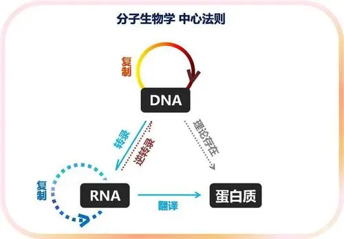
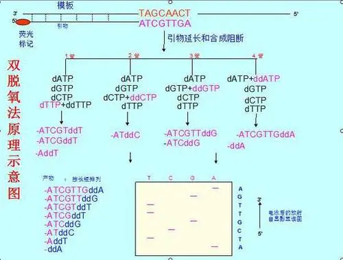

核酸在生命活动中起着重要的作用，核酸有两类：

- DNA

携带决定个体性状的遗传信息

- RNA

参与遗传信息的表达与调控

DNA是携带遗传信息的载体之一，而生物体的遗传信息以特定核苷酸排列顺序存储，不同生物体具有不同的排列顺序，不同的排列顺序蕴含着不同的生物信息。

核酸序列包含着生物的遗传信息和进化信息，所以获取核酸序列并从中获取和挖掘信息是极为重要的。

***

# DNA测序技术

## 一代测序技术

### 双脱氧链终止法

DNA是由脱氧核糖核苷酸（dNTP）通过磷酸二酯键连接并形成DNA链，而双脱氧核糖核苷酸（ddNTP）的2'和3'位置都不含羟基，在DNA的合成反应体系中加入ddNTP，ddNTP只能通过磷酸基团形成一个磷酸二酯键而无法在向下延伸使合成反应中断。

### 化学降解法

与双脱氧链终止法原理相似，但是通过特异性对某一类碱基进行切割获得不同长度的降解产物。

化学降解法与双脱氧链终止法相比重复性高，且只需要简单的化学试剂和一般的实验条件，易于掌握。

## 二代测序技术

一代测序技术具有速度慢，成本高，通量低的缺点难以大规模的应用，所以具备速度快，通量高，成本低等特点的二代测序技术产生了。

二代测序技术主要有：

- 罗氏公司的454测序仪
- illumina公司的Solexa测序仪
- ABI公司的SOLID测序仪

不同的平台测序原理各不相同，但他们都有以下几个共同点：

1,文库建立：所有二代测序的平台都需要一个基因文库，这个基因文库包含通过引申或者连接自定义的接头序列。

2,测序仪器：每个文库片段在共阶吸附的DNA连接因子的作用下，以文库适配序列为模版，在固体表面上进行扩增。这步扩增会产生许多DNA蔟，每个来源于一个文库片段，每个基因蔟都会像独立的测序反应一样起作用。

3,数据输出：每个仪器都会在测序结束后给出原始数据。这个原始数据时每个基因蔟中形成的DNA序列的集合。

## 三代测序技术

 三代测序技术是基于单分子信号检测的DNA测序，目前包括：

- Helicos的tSMS
- PacBio的SMART
- Oxford的Nanopore

以及一些尚处于实验室阶段的的技术，如电镜测序，蛋白质晶体管测序。

现如今最流行的仍然是二代测序技术。
